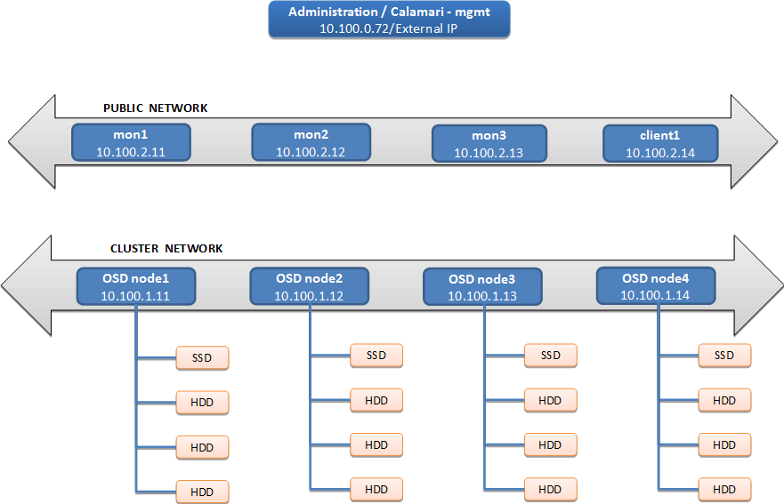
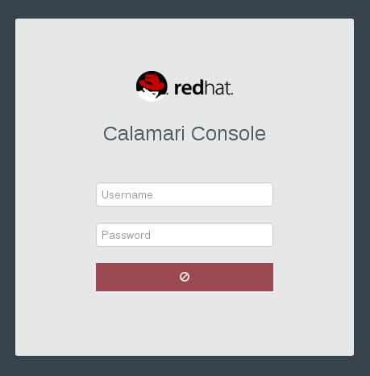
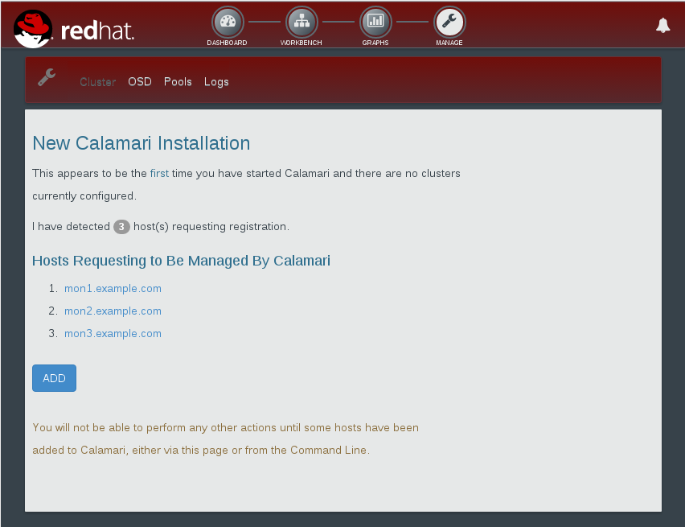
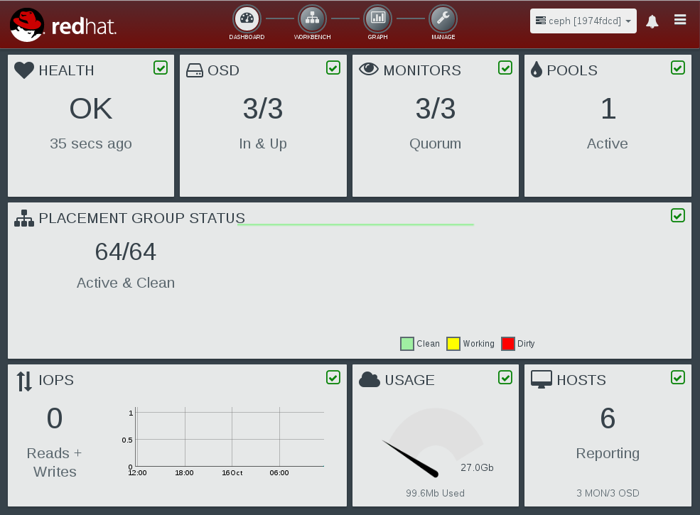
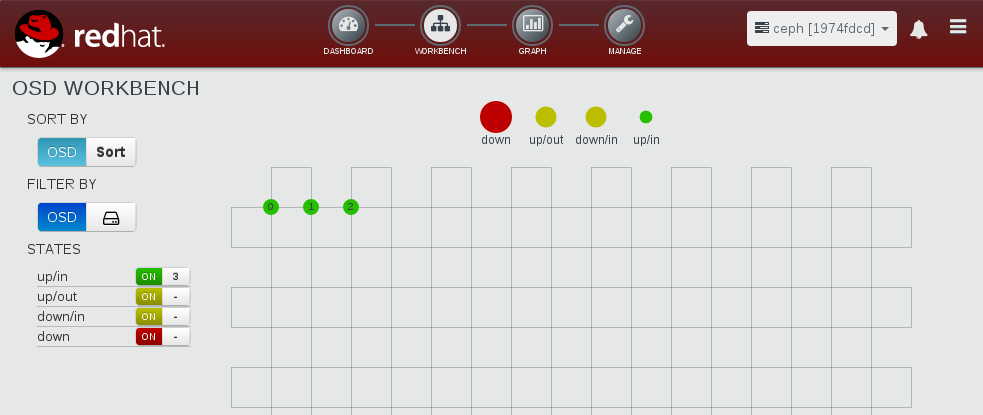

:scrollbar:
:toc2:

== Architecture Lab

.Goals

* Install a Red Hat Ceph Storage cluster
* Verify cluster is running using Calamari 
* Verify cluster is running using the CLI
* Create a block device 
* Mount the block device 
* Write data to block device
* Read data from block device

.Concepts
[cols="2,5"]
|===
|Term   |Description
|Ceph Calamari  | Graphical management and monitoring system for Ceph storage cluster.
|Ceph OSD (Object Store Device)  | Directory on a regular file system that Ceph uses, which usually corresponds to a physical disk. Ceph OSDs store data on behalf of Ceph clients. Additionally, Ceph OSDs use the CPU and memory of Ceph nodes to perform data replication, rebalancing, recovery, monitoring, and reporting.
|Ceph Mon (Monitor)  | A daemon that maintains a master copy of the Ceph storage cluster map with the current state of the storage cluster.
|Ceph PG (Placement Group)  | Logical container for objects assigned to OSDs. A placement group is consists of a number of OSDs equal to either the number of replicas (in the case of replication) or in the case of erasure coding, the sum of _k_ (the original amount of data) and _m_ (extra or redundant symbols added to provide protection from failures). A single OSD can have data from multiple placement groups.
|Ceph Pool  | Logical partitions for storing objects via the PGs assigned to a pool. A Ceph pool is a group of PGs containing OSDs.
|RADOS Block Devices (RBDs)  | Logical block-storage devices that mount like physical storage drives for use by both physical and virtual systems (includes QEMU/KVM driver).
|RADOS Object Storage Utility  | Program for interacting with the Ceph object storage cluster.
|===

:numbered:

== Prepare the Lab Environment

To complete the labs for this course, you must provision the lab environment to have access to the all of the required components.

. Go to https://labs.opentlc.com and use your credentials to log in to the OPENTLC labs provisioning system.
+
[NOTE]
This system is built on top of Red Hat CloudForms to provide a self-service portal.
+
[TIP]
If you forgot your username or password, go to https://www.opentlc.com/pwm to reset your password or obtain a username reminder.

. Navigate to *Services* -> *Catalogs* -> *All Services* -> *OPENTLC Cloud Infrastructure Labs*.

. Locate *Ceph 1.3 FASTRAX Lab* on the left side of the screen.

. Click *Order* (appears on the right).

. Click *Submit* (in the lower right) to order your environment.
+
[NOTE]
In a few minutes you will receive an email describing how to connect to the environment.
+
[WARNING]
Do not select *App Control* -> *Start* after ordering the lab. The lab is already starting. Selecting *Start* may corrupt the lab environment or cause other complications.

. Wait 20-30 minutes to allow your environment to build.

. Select *Status* to receive an email with the status of your environment. You may repeat this step as needed.
+
[NOTE]
The lab environment is cloud-based, so you can access it over the WAN from anywhere. Do not, however, expect performance to match a bare-metal environment.
+
. When your lab environment is ready, follow the instructions in the email to connect to the environment.

== Set Up SSH

To access any of your lab systems via SSH, you must use your personal OPENTLC SSO username and public SSH key. Unless otherwise noted, you cannot use SSH to connect directly as `root`.

[NOTE]
If you have not already done so, you must provide a public SSH key.

. Go to https://www.opentlc.com/update and log in.

. Paste your public key in that location.

. Connect to your administration host via SSH using your OPENTLC username and private SSH key.

* Replace GUID with your personal GUID, which is located at the top of your lab provisioning email.
+
[subs="verbatim,macros"]
----
ssh -i ~/.ssh/yourprivatekey.key opentlc-username.com@mgmt-GUID.rhpds.opentlc.com
----
+

[NOTE]
====
If you are using Windows, use a terminal program such as PuTTY instead of the command shown here.

For more information on using SSH and keys, see https://www.opentlc.com/ssh.html.
====

. Become the `root` user on the administration host:
+
[subs="verbatim,macros"]
----
-bash-4.2$ pass:quotes[*sudo -i*]
----

== Install Red Hat Ceph Storage

. From the `mgmt` node as `root`.

. Install the Ceph setup utility:
+
[subs="verbatim,macros"]
----
[root@mgmt-GUID ~]# pass:quotes[*GUID=`hostname -s|cut -f2 -d-`*]
[root@mgmt-GUID ~]# pass:quotes[*mkdir ~/ceph-deploy*]
[root@mgmt-GUID ~]# pass:quotes[*cd ~/ceph-deploy*]
[root@mgmt-GUID ceph-deploy]# pass:quotes[*yum install -y ceph-deploy calamari-server calamari-clients*]
[root@mgmt-GUID ceph-deploy]# pass:quotes[*ceph-deploy install --cli mgmt-$GUID*]
...
[mgmt-GUID][DEBUG ] Complete!
[mgmt-GUID][INFO  ] Running command: ceph --version
[mgmt-GUID][DEBUG ] ceph version 0.94.1 (e4bfad3a3c51054df7e537a724c8d0bf9be972ff)
----

. Look for `Complete!` upon successful installation.

== Set Up Red Hat Ceph Storage

In this lab, you use the Ceph Calamari management interface to initialize and verify the cluster.

. Verify you are still in the `ceph-deploy` directory and if not, change to this directory:
+
[subs="verbatim,macros"]
----
[root@mgmt-GUID ~]# pass:quotes[*cd ~/ceph-deploy*]
----

. From the `mgmt` node as `root`, initialize Calamari monitoring: 
+
[subs="verbatim,macros"]
----
[root@mgmt-GUID ceph-deploy]# pass:quotes[*calamari-ctl initialize*]
[INFO] Loading configuration..
[INFO] Starting/enabling salt...
[INFO] Starting/enabling postgres...
[INFO] Initializing database...
[INFO] You will now be prompted for login details for the administrative user account. This is the account you will use to log into the web interface once setup is complete.
Username (leave blank to use 'root'): 
----

. Enter the username you want to use for the administrative user account. To use the default of `root`, leave this blank.
+
----
Username (leave blank to use 'root'): 
Email address:
----
+
[NOTE]
Remember the Calamari admin username you entered here; you need it to log in to the Calamari UI when setup is complete.

. Leave *Email address* blank.
+
----
Email address: 
Password:
----

. When prompted to create a password, enter `r3dh4t1!`.
+
[subs="verbatim,macros"]
----
Password: pass:quotes[*r3dh4t1!*]
Password (again): pass:quotes[*r3dh4t1!*]
Superuser created successfully.
[INFO] Initializing web interface...
[INFO] Starting/enabling services...
[INFO] Restarting services...
[INFO] Complete.
----

== Create Red Hat Ceph Storage Cluster

. Use the `ceph-deploy new` command to create the Ceph cluster and specify the monitors:
+
[subs="verbatim,macros"]
----
[root@mgmt-GUID ceph-deploy]# pass:quotes[*ceph-deploy new mon1 mon2 mon3*]
----
+
[NOTE]
During this portion of the cluster setup, enter `yes` if the following prompt appears: `Are you sure you want to continue connecting (yes/no)`.
. Review the generated `ceph.conf`:
+
[subs="verbatim,macros"]
----
[root@client-GUID ceph-deploy]# pass:quotes[*cat ~/ceph-deploy/ceph.conf*]
[global]
fsid = ff35c956-a012-451c-b6f4-b08ff4a0c741
mon_initial_members = mon1, mon2, mon3
mon_host = 10.100.2.11,10.100.2.12,10.100.2.13
auth_cluster_required = cephx
auth_service_required = cephx
auth_client_required = cephx
filestore_xattr_use_omap = true
----

. Before deploying the OSDs, update the configuration file to use these specific parameters:
+
* Set the OSD journal size to `1024MB`.
* Set the default replication size to `2` for your small test cluster.
* Allow dynamic updates of the primary OSD affinity.

.. Open the configuration file in the `vi` text editor:
+
[subs="verbatim,macros"]
----
[root@client-GUID ceph-deploy]# pass:quotes[*vi ~/ceph-deploy/ceph.conf*]
----

.. Add the following lines at the end of the file:
+
[subs="verbatim,macros"]
----
pass:quotes[*osd journal size = 1024
osd pool default size = 2
osd pool default min size = 1
mon osd allow primary affinity = 1*]
----

. Install the Ceph code on the nodes in the cluster:
+
[subs="verbatim,macros"]
----
[root@mgmt-GUID ceph-deploy]# pass:quotes[*ceph-deploy install mgmt-$GUID mon1 mon2 mon3 node1 node2 node3 node4*]
----

. Add the initial monitor node:
+
[subs="verbatim,macros"]
----
[root@mgmt-GUID ceph-deploy]# pass:quotes[*ceph-deploy mon create-initial*]
----

. Connect the monitors to Calamari:
+
[subs="verbatim,macros"]
----
[root@mgmt-GUID ceph-deploy]# pass:quotes[*ceph-deploy calamari connect mon1 mon2 mon3 --master mgmt-$GUID.rhpds.opentlc.com*]
----

== Add OSD

In this lab, you use the `ceph-deploy` command to add three OSDs to the Ceph cluster. To see what disk drives are available for each node, use the `ceph-deploy disk list` command. The disk lettering scheme is dynamic and may vary from node to node.

. From the `mgmt` node as user `root`, list the disks available to act as OSD devices:
+
[subs="verbatim,macros"]
----
[root@mgmt-GUID ceph-deploy]# pass:quotes[*ceph-deploy disk list node1*]
[ceph_deploy.conf][DEBUG ] found configuration file at: /root/.cephdeploy.conf
[ceph_deploy.cli][INFO  ] Invoked (1.5.25): /bin/ceph-deploy disk list node1
[node1][DEBUG ] connected to host: node1 
[node1][DEBUG ] detect platform information from remote host
[node1][DEBUG ] detect machine type
[ceph_deploy.osd][INFO  ] Distro info: Red Hat Enterprise Linux Server 7.1 Maipo
[ceph_deploy.osd][DEBUG ] Listing disks on node1...
[node1][DEBUG ] find the location of an executable
[node1][INFO  ] Running command: /usr/sbin/ceph-disk list
[node1][DEBUG ] /dev/sr0 other, unknown
[node1][DEBUG ] /dev/vda :
[node1][DEBUG ]  /dev/vda1 other
[node1][DEBUG ]  /dev/vda2 other, xfs, mounted on /
[node1][DEBUG ] /dev/vdb other, unknown
[node1][DEBUG ] /dev/vdc other, unknown
[node1][DEBUG ] /dev/vdd other, unknown
[node1][DEBUG ] /dev/vde other, unknown
[root@mgmt-GUID ceph-deploy]# 
----

. Configure the `vdb` drive on each node to use as an OSD:
+
[subs="verbatim,macros"]
----
[root@mgmt-GUID ceph-deploy]# pass:quotes[*ceph-deploy osd --zap create node1:vdb node2:vdb node3:vdb*]
----

* In this lab you are creating one OSD per host for simplicity. 
* In a real-world cluster you would configure multiple OSDs per host. 
* The cluster you set up looks similar to this:
+
.Ceph Cluster

== Administer Cluster

. From the `mgmt` node as user `root`, make the `mgmt` host an administration client for the Ceph cluster:
+
[subs="verbatim,macros"]
----
[root@mgmt-GUID ceph-deploy]# pass:quotes[*ceph-deploy admin mgmt-$GUID*]
[root@mgmt-GUID ceph-deploy]# pass:quotes[*chmod +r /etc/ceph/ceph.client.admin.keyring*]
----

. Check the health of the cluster:
+
[subs="verbatim,macros"]
----
[root@mgmt-GUID ceph-deploy]# pass:quotes[*ceph health*]
----
+
[NOTE]
Three possible values: HEALTH_OK, HEALTH_WARN, and HEALTH_ERR

. Get another view of the cluster's status (type `Ctrl+C` to stop): 
+
[subs="verbatim,macros"]
----
[root@mgmt-GUID ceph-deploy]# pass:quotes[*ceph -w*]
----

. Get a tree listing of the OSDs in the cluster and their status:
+
[subs="verbatim,macros"]
----
[root@mgmt-GUID ceph-deploy]# pass:quotes[*ceph osd tree*]
----

. Display the pools configured in the cluster:
+
[subs="verbatim,macros"]
----
[root@mgmt-GUID ceph-deploy]# pass:quotes[*ceph osd lspools*]
----

. Display the quorum status of the monitors:
+
[subs="verbatim,macros"]
----
[root@mgmt-GUID ceph-deploy]# pass:quotes[*ceph quorum_status --format json-pretty*]
----

. Issue the `quorum_status` command again without the `json-pretty` formatting and compare the two:
+
[subs="verbatim,macros"]
----
[root@mgmt-GUID ceph-deploy]# pass:quotes[*ceph quorum_status*]
----

== Log in to Calamari Console

. Use a browser to go to the management node: http://mgmt-GUID.rhpds.opentlc.com.

. Use the credentials established during the `calamari-ctl initialize` command (`root`/`r3dh4t1!`) to log in:
+

  
== Add Hosts to Calamari

. Click *ADD* to establish the Ceph cluster and set up the monitors:
+

. Wait for the cluster to finish initializing; when prompted click *Close*.
  
== Check Cluster Status

. In the Calamari UI, click *DASHBOARD*  to check the cluster status:
+

+ 
[NOTE]
In this lab environment occasionally there may be errors reported in the cluster. You can view the errors by clicking *MANAGE*, then *LOGS*. You can ignore these errors.

== Check OSD Status

. In the Calamari UI, click *WORKBENCH* to check the status of the OSDs:
+

  
== Access Block Device Using RBD

For block mode testing in this lab, use the client node to access the Ceph cluster. First install the Ceph software and allow the client to use administration commands.  

. From the `mgmt` node as `root`.

. Install Ceph code on `client1`:
+
[subs="verbatim,macros"]
----
[root@mgmt-GUID ceph-deploy]# pass:quotes[*ceph-deploy install client1*]
----

. Install admin code on `client1`:
+
[subs="verbatim,macros"]
----
[root@mgmt-GUID ceph-deploy]# pass:quotes[*ceph-deploy admin client1*]
----

. Generate a `keyring` file on the `mgmt` node, then copy `keyring` contents to a file on the `client1` node:
+
[subs="verbatim,macros"]
----
[root@mgmt-GUID ceph-deploy]# pass:quotes[*ceph auth get-or-create client.rbd.client1 osd \'allow rwx pool=rbd' mon \'allow r' -o /etc/ceph/ceph.client.client1.keyring*]
[root@mgmt-GUID ceph-deploy]# pass:quotes[*cat /etc/ceph/ceph.client.client1.keyring | ssh client1 tee /etc/ceph/ceph.client.client1.keyring*]
----

. Copy the `ceph.conf` file from the `mgmt` node to the client node:
+
[subs="verbatim,macros"]
----
[root@mgmt-GUID ceph-deploy]# pass:quotes[*cat /etc/ceph/ceph.conf | ssh client1 tee /etc/ceph/ceph.conf*]
----

. Create the RBD named `blocktest` with the size of 128MB:
+
[subs="verbatim,macros"]
----
[root@mgmt-GUID ceph-deploy]# pass:quotes[*rbd create blocktest --size 128*]
----

. View the details of the newly created RBD:
+
[subs="verbatim,macros"]
----
[root@mgmt-GUID ceph-deploy]# pass:quotes[*rbd info blocktest*]
----

. Access the Ceph block device from `client1` and create a file system on it.  

.. Log in to client as user `root`:
+
[subs="verbatim,macros"]
----
[root@mgmt-GUID ceph-deploy]# pass:quotes[*ssh root@client1*]
----

.. Verify the RDB service is running:
+
[subs="verbatim,macros"]
----
[root@client1 ~]# pass:quotes[*modprobe rbd*]
[root@client1 ~]# pass:quotes[*lsmod | grep rbd*]
----

.. Map the blocktest RBD image to a block device:
+
[subs="verbatim,macros"]
----
[root@client1 ~]# pass:quotes[*rbd map blocktest*]
----

.. View the mapped RBD image:
+
[subs="verbatim,macros"]
----
[root@client1 ~]# pass:quotes[*rbd showmapped*]
----

.. Make an `ext4` filesystem on the mapped RBD image:
+
[subs="verbatim,macros"]
----
[root@client1 ~]# pass:quotes[*mkfs.ext4 /dev/rbd0*]
----

. Create a mount point and mount the mapped RBD image to it:
+
[subs="verbatim,macros"]
----
[root@client1 ~]# pass:quotes[*mkdir /mnt/rbd*]
[root@client1 ~]# pass:quotes[*mount /dev/rbd0 /mnt/rbd*]
----

. Write a file on `/mnt/rbd` as a regular file system:
+
[subs="verbatim,macros"]
----
[root@client1 ~]# pass:quotes[*echo "hello world" > /mnt/rbd/testfile.txt*]
----

. Read the file from the mount point:
+
[subs="verbatim,macros"]
----
[root@client1 ~]# pass:quotes[*cat /mnt/rbd/testfile.txt*]
----

== Clean Up

. Unmount the RBD device:
+
[subs="verbatim,macros"]
----
[root@client1 ~]# pass:quotes[*umount /mnt/rbd*]
----

. Remove the RBD device:
+
[subs="verbatim,macros"]
----
[root@client1 ~]# pass:quotes[*rbd unmap /dev/rbd0*]
[root@client1 ~]# pass:quotes[*rbd rm blocktest*]
[root@client1 ~]# pass:quotes[*exit*]
----

:numbered!: