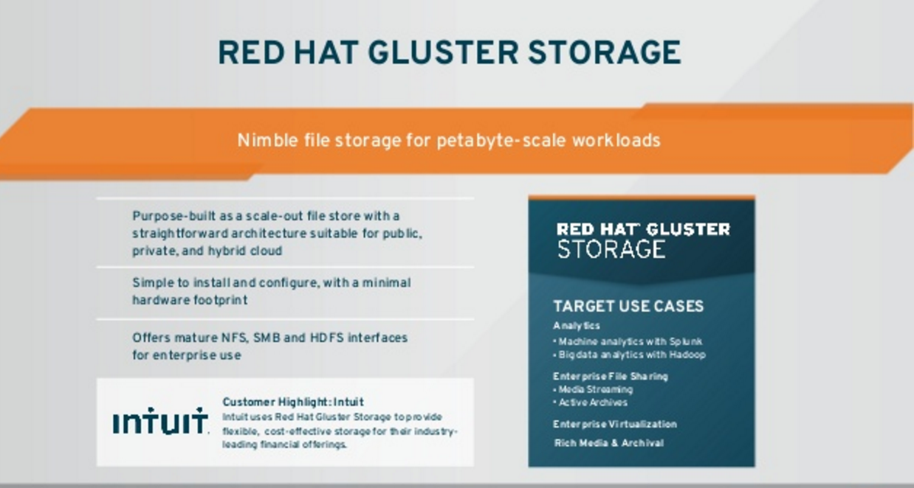

:scrollbar:

== Popular Use Cases

ifdef::showscript[]

=== Transcript

Two of the most popular use-cases for Gluster include file storage and cloud infrastructure. Red Hat Enterprise Virtualization integrates tightly with RHGS to provide live virtual image storage. Large file storage via FUSE, NFS or SMB clients is an excellent use case.  

endif::showscript[]
