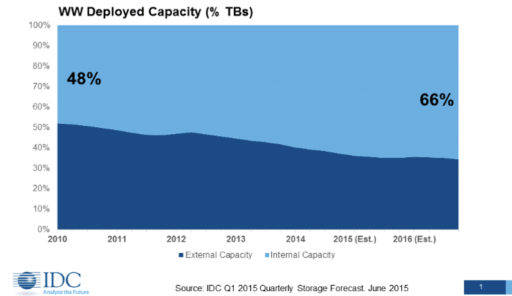

:scrollbar:

== Server-Based Storage Capacity

ifdef::showscript[]

=== Transcript

If your customer is a candidate for scale-out storage, they are part of a larger storage market trend illustrated by this IDC study. After decades of external SAN/NAS capacity growth, the market for storage since 2010 has clearly shifted back toward internal storage capacity on standard servers. Internal storage capacity on servers requires software to provide high availability and data protection across these servers -- hence the growth of software-defined storage.

endif::showscript[]
