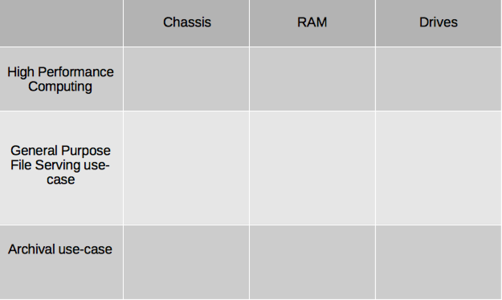

:scrollbar:
:data*uri:

== Identification of Ideal Workload Profile

ifdef::showscript[]

=== Transcript

This 4x3 matrix is useful in structuring the cluster design conversation with your customer. 

* High Performance Computing 
* General Purpose File Serving use-case
* Archival use-case

endif::showscript[]
