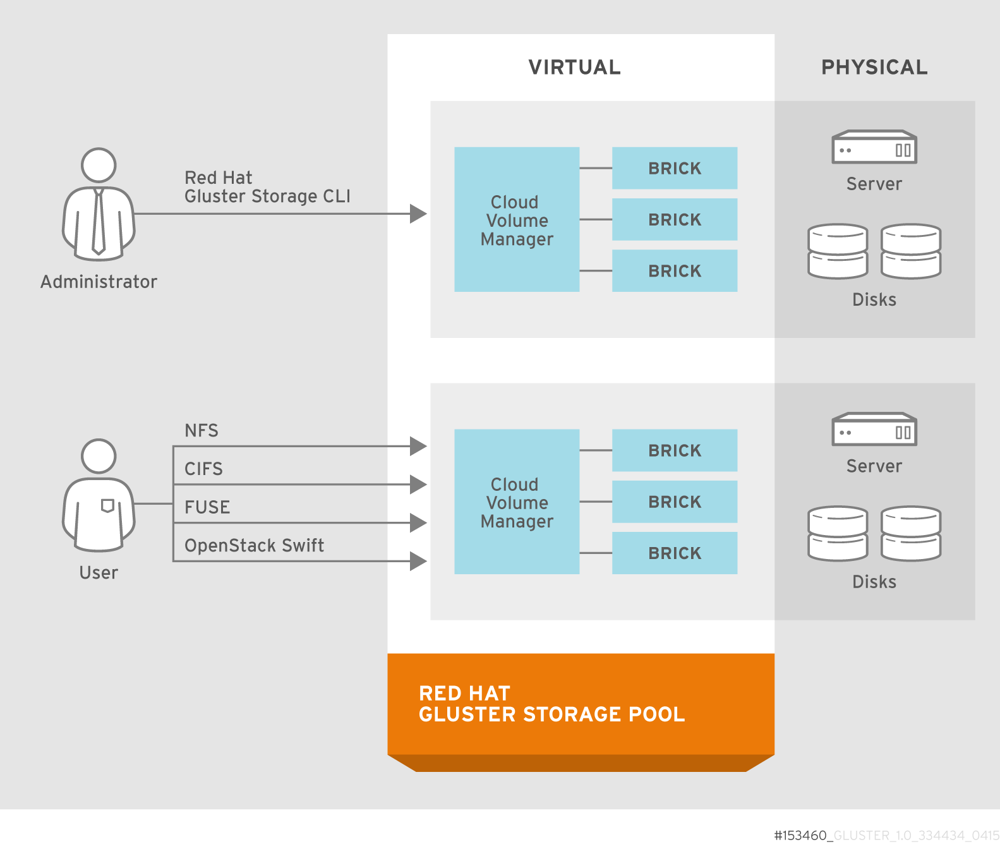

:scrollbar:

== Storage Access Methods

ifdef::showscript[]

=== Transcript

The third design consideration is storage access method. Red Hat Gluster Storage can be accessed via the native GLusterFS FUSE client, Ganesha NFS (v3 or 4) and SMB. Gluster Native Client – This method provides high concurrency, performance and transparent failover in GNU/Linux clients. The Gluster Native Client is POSIX conformant. 
NFS – This method provides access to gluster volumes with NFS v3 or v4.
CIFS – This method provides access to volumes when using Microsoft Windows as well as SAMBA clients. For this access method, Samba packages need to be present on the client side.

endif::showscript[]
