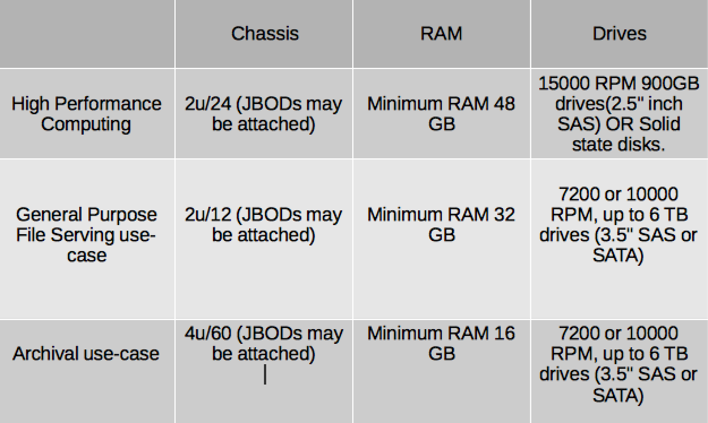

:scrollbar:

== Optimized Configurations

ifdef::showscript[]

=== Transcript

This chart populates the 4x3 matrix created earlier with the optimal configurations based on the Compatible Physical, Virtual Server and Client OS Platforms. While specific use cases may require different architecture, the core principles behind this 4x3 matrix are good guidelines.   

endif::showscript[]
